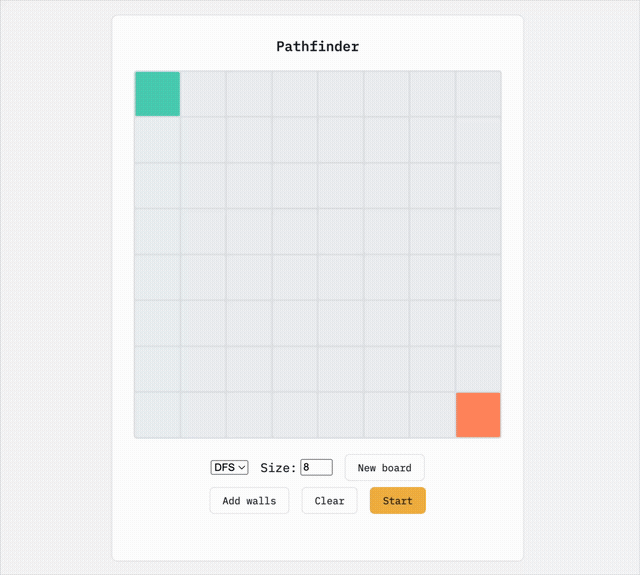

# Grid Pathfinder

A small interactive visualizer for pathfinding algorithms on a grid. Draw walls, pick BFS or DFS, and watch the search explore the grid tile by tile before tracing out the final path.

## Demo



## Features

- **Two algorithms** — switch between Breadth-First Search and (recursive) Depth-First Search from a dropdown
- **Adjustable board size** — enter a size (3–25) and click "New board" to rebuild the grid at that dimension; the board itself always renders at the same fixed pixel size, so tiles just scale to fit
- **Wall drawing mode** — toggle "Add walls" and click tiles to mark them as obstacles the search can't cross
- **Animated search** — visited tiles and dead ends light up in real time as the algorithm runs
- **Path highlighting** — once the goal is found, the found path is traced across the grid
- **No-path detection** — if the goal is unreachable, a status message says so instead of leaving you guessing
- **Two-stage Clear button** — first click clears the search/path styling only; the button relabels itself to "Clear walls" and a second click wipes the walls too
- **Light / dark theme toggle** — persisted across visits via `localStorage`

## How it works

The grid is a size×size set of tiles (default 8x8, adjustable via the size input). The top-left tile is the start (`.first`), the bottom-right tile is the goal (`.last`). Clicking **Start** turns off wall-drawing mode if it's on, then runs the selected algorithm from the start tile:

- **BFS** (`bfs.js`) explores level by level using a queue, tracking each tile's predecessor so it can reconstruct the shortest path once it reaches the goal.
- **DFS** (`dfs.js`) explores recursively, marking tiles as visited (and additionally as dead ends when it backtracks) so it never re-enters a tile it has already explored, and returns the first path it finds to the goal.

Both algorithms treat tiles with the `active` class (walls) as blocked and pause briefly (`sleep(10)` in `utils.js`) between steps so the search is visible instead of instant. If neither algorithm can reach the goal, `main.js` shows a "No path exists" message.

## Project structure

```
.
├── index.html          # markup, theme toggle script
├── style.css            # grid layout, tile states, light/dark theme variables
├── main.js               # grid setup, event wiring, wall mode, start/clear logic
├── utils.js              # shared sleep() helper for animation timing
└── algorithms/
    ├── bfs.js             # breadth-first search + path reconstruction
    └── dfs.js             # recursive depth-first search with backtracking
```

## Running it

This is a static site with no build step or dependencies. Easiest option: just open `index.html` directly in a browser (double-click it, or right-click → Open With).

If you'd rather serve it locally, that works too:

```bash
npx serve .
# or
python3 -m http.server
```

Then visit the printed local URL.

## Usage

1. (Optional) Enter a board size and click **New board** to rebuild the grid at that size.
2. Click **Add walls**, then click tiles to mark them as obstacles. Click **Add walls** again to exit wall mode.
3. Pick **DFS** or **BFS** from the dropdown.
4. Click **Start** to run the search and watch it animate.
5. Click **Clear** once to reset the search visualization, or twice to also clear the walls.

## Ideas for future improvements

- Adjustable animation speed
- Draggable start/end tiles
- Additional algorithms (A*, Dijkstra, greedy best-first)
- Diagonal movement option
